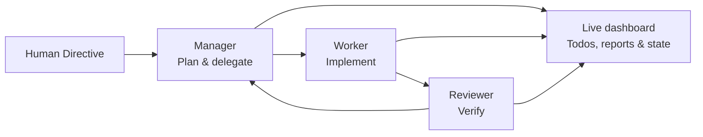

<p align="center">
  <a href="README.md"><strong>English</strong></a>
  &nbsp;·&nbsp;
  <a href="README.zh-TW.md">繁體中文</a>
</p>

<p align="center">
  
</p>

<h1 align="center">Task Hounds</h1>

<p align="center">
  <strong>Work like a dog. Ship like a pack.</strong><br>
  A local, inspectable multi-agent development workspace powered by OpenCode.
</p>

<p align="center">
  <a href="https://task-hounds.com">Website</a>
  · <a href="https://github.com/catowabisabi/task-hounds">GitHub</a>
  · <a href="https://www.youtube.com/watch?v=pu-Rt8Ye4EQ&t=174s">Demo</a>
  · <a href="https://github.com/catowabisabi/task-hounds/issues">Issues</a>
</p>

<p align="center">
  <a href="https://github.com/catowabisabi/task-hounds/actions/workflows/ci.yml"></a>
  <a href="LICENSE"></a>
  
  
  
  
</p>

<p align="center">
  
</p>

## What is Task Hounds?

Task Hounds turns one human goal into a visible development loop. Give the pack a **Human Directive**; the Manager plans, the Worker implements, and the Reviewer checks the result before the next task begins.

Unlike a black-box coding assistant, Task Hounds keeps the work inspectable. Directives, plans, todos, reports, agent state, and reusable OpenCode sessions are stored locally, while the dashboard shows what every agent is doing in real time.

It is designed for developers who want agent autonomy **without giving up control or context**.

## The pack

| Role | Responsibility |
| --- | --- |
| **You** | Set the durable project mission, add ideas, and redirect the work at any time. |
| **Manager** | Understand context, maintain the plan, and assign one concrete task at a time. |
| **Worker** | Implement the selected task and report files changed, tests, and known issues. |
| **Reviewer** | Inspect the result for bugs, UX problems, edge cases, and safety risks. |
| **Chat** | Let you discuss the project and interact with the system directly. |



## Detailed workflow

### Human input contract

| Input | Meaning | Lifecycle |
| --- | --- | --- |
| `HUMAN_DIRECTIVE` | The durable project or session mission. | Copied into each new session in the same project. The agent loop never edits or deletes it; only a human can change it. |
| `HUMAN_NEW_THOUGHT_AND_SUGGESTION` | Direction, questions, product taste, concerns, or ideas. | The Manager digests it, may turn it into todo items, then marks it processed while preserving its history. |
| `HUMAN_SUGGESTED_NEW_TASK_OR_ITEM` | An explicit feature or work item. | The Manager adds it to the plan and todo system when appropriate, then marks it processed while preserving its history. |

The loop runs on an explicit message contract: the Manager digests input, decides,
plans, and releases exactly one task; the Worker implements and files a structured
report; the Reviewer verifies and routes feedback back to the Manager. Machine-readable
todo JSON is validated (and repaired) before any work is released.

**Full specification — complete loop, role/data-flow diagram, time sequence, and hard
rules: [docs/architecture/agent-loop-contract.md](docs/architecture/agent-loop-contract.md)**

## Why Task Hounds?

- **Local first** — your workspace, database, runtime state, and logs stay on your machine.
- **Inspectable by design** — follow live thinking, tool activity, todos, reports, and review feedback.
- **Persistent context** — SQLite-backed project state and reusable role sessions survive across loops.
- **Clear responsibilities** — planning, implementation, and review are handled by separate agents.
- **Human steerable** — change direction with durable directives, thoughts, and suggested tasks.
- **Multiple ways to run** — web dashboard, Windows desktop app, Docker, and an experimental Android client.
- **Open source** — MIT licensed and ready to adapt.

## See it in action

<p align="center">
  <a href="https://www.youtube.com/watch?v=pu-Rt8Ye4EQ&t=174s">
    
  </a>
</p>

<p align="center">
  
</p>

## Quick start

### Fastest way: Docker Compose (any platform)

```bash
git clone https://github.com/catowabisabi/task-hounds.git
cd task-hounds
docker compose up
```

Then open [http://localhost:8765](http://localhost:8765). The image builds the dashboard for you — no Python or Node setup required. Project data persists in `./data`.

### From source (Windows, recommended for the managed runtime)

#### Requirements

- Windows (recommended for the managed runtime and desktop build)
- Python 3.11+
- Node.js 20+
- npm

### 1. Clone and install

```powershell
git clone https://github.com/catowabisabi/task-hounds.git
cd task-hounds

.\installation.cmd
pip install -r requirements.txt
pip install .
```

`installation.cmd` installs the pinned, managed OpenCode runtime used by Task Hounds.

### 2. Build the dashboard

```powershell
cd ui/web
npm ci
npm run build
cd ../..
```

### 3. Configure

```powershell
Copy-Item .env.example .env
```

Task Hounds keeps the legacy `POWER_TEAMS_` environment-variable prefix for compatibility. Review `.env.example` before adding provider keys or exposing the API beyond localhost.

### 4. Run

```powershell
task-hounds-serve --port 8765
```

(Equivalent: `python -m task_hounds_api --port 8765`.)

Open [http://localhost:8765](http://localhost:8765), create or select a workspace, write a Human Directive, then choose **Start Loop** or **Run Once**.

By default, projects are created under `~/task-hounds-projects`. Override with the `TASK_HOUNDS_PROJECTS_DIR` environment variable. Existing installs that already use `C:\task-hounds-projects` keep working unchanged.

> Task Hounds will not begin autonomous work without a pending Human Directive.

For more detail, see the [Getting Started guide](docs/guides/getting-started.md).

## Model providers

Task Hounds talks to models through OpenCode's Anthropic-compatible providers. Three are bundled — bring any one key and the pack runs:

| Provider | Models | Env key |
| --- | --- | --- |
| MiniMax (default) | `MiniMax-M2.7` | `OPENCODE_API_KEY_MINIMAX` |
| Moonshot Kimi | `kimi-k3` (1M context), `kimi-k2.7-code`, `kimi-k2.7-code-highspeed` | `OPENCODE_API_KEY_KIMI` |
| Alibaba Bailian | Qwen3.x, GLM, Kimi K2.5 | `OPENCODE_API_KEY_BAILIAN` |

The default model for every role is `minimax-coding-plan/MiniMax-M2.7`.

### Switch the whole pack to Kimi K3

Kimi K3 ships with a 1M-token context window and thinking on by default — a great fit for long agent loops. Get a key from the [Kimi Open Platform](https://platform.kimi.ai/console/api-keys), then in `.env`:

```dotenv
OPENCODE_API_KEY_KIMI=your_kimi_api_key
TASK_HOUNDS_OPENCODE_MODEL=kimi-coding-plan/kimi-k3
```

Restart, and Manager, Worker, and Reviewer all run on Kimi K3. You can also paste the key in the dashboard's Runtime panel, or pick the model per role in the binding editor.

### Mix models per role

Each role resolves its model independently, so you can put the strongest reasoner where it matters:

```dotenv
TASK_HOUNDS_MANAGER_OPENCODE_MODEL=kimi-coding-plan/kimi-k3
TASK_HOUNDS_REVIEWER_OPENCODE_MODEL=kimi-coding-plan/kimi-k3
# Worker stays on the default MiniMax-M2.7
```

Role bindings set in the dashboard (stored in the DB) override these env vars.

## Other ways to run

### Docker (without Compose)

```bash
docker build -t task-hounds .
docker run --rm -p 8765:8765 -v "$(pwd)/data:/app/data" task-hounds
```

### pip install from Git

```bash
pip install git+https://github.com/catowabisabi/task-hounds.git
task-hounds --port 8765
```

This installs the backend server and CLI. The web dashboard is served when running from a repo checkout or Docker; a pip-only install exposes the HTTP API.

### Windows desktop app

```powershell
.\build_exe.ps1
```

The portable Electron build is written to `ui/desktop/dist/`.

### Android client

The experimental React + Capacitor client is in `ui/mobile/`. It connects to the same backend and shares projects, sessions, todos, chat, and agent state. Private access through [Tailscale Serve](https://tailscale.com/docs/features/tailscale-serve) is recommended; do not expose the backend directly to the public internet.

See [ui/mobile/README.md](ui/mobile/README.md) for setup instructions.

## Architecture

SQLite is the runtime source of truth for project sessions, directives, todos, reports, suggestions, and agent state. Compatibility files under `core/runtime/` are local runtime mirrors and fallbacks.

```text
task-hounds/
├── core/
│   ├── db/                  # SQLite schema, migrations, and backups
│   ├── runtime/             # Local runtime state and logs (not committed)
│   └── task_hounds_api/     # Backend: FastAPI server, agent workflow, OpenCode runtime
│       ├── api/             # HTTP API and dashboard server
│       ├── db/              # DB access layer
│       ├── opencode/        # Managed OpenCode runtime and client
│       └── workflow/        # Manager/Worker/Reviewer loop, contracts, repair
├── ui/
│   ├── web/                 # React + Vite dashboard
│   ├── desktop/             # Electr