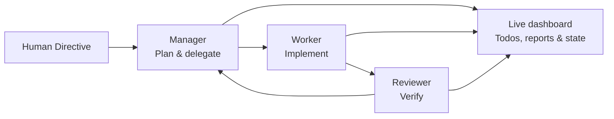
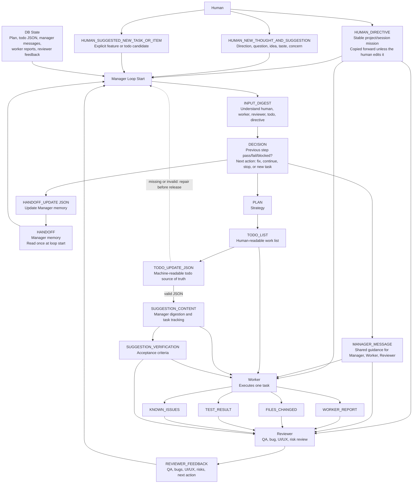
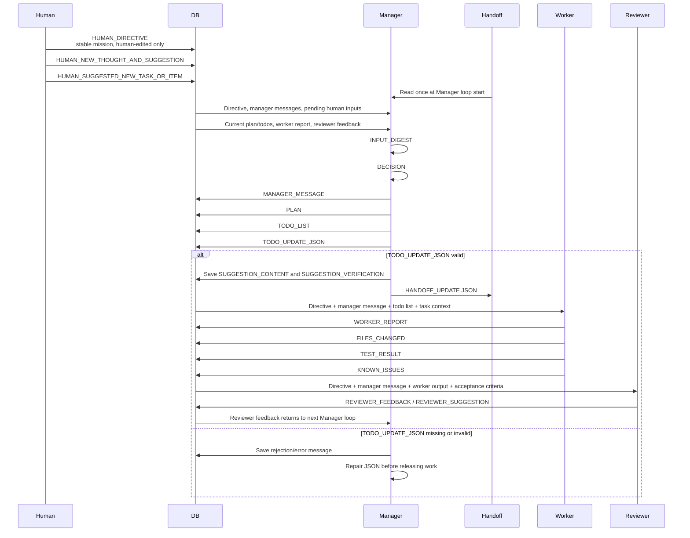

<p align="center">
  <a href="README.md"><strong>English</strong></a>
  &nbsp;·&nbsp;
  <a href="README.zh-TW.md">繁體中文</a>
</p>

<p align="center">
  
</p>

<h1 align="center">Task Hounds</h1>

<p align="center">
  <strong>Work like a dog. Ship like a pack.</strong><br>
  A local, inspectable multi-agent development workspace powered by OpenCode.
</p>

<p align="center">
  <a href="https://task-hounds.com">Website</a>
  · <a href="https://github.com/catowabisabi/task-hounds">GitHub</a>
  · <a href="https://www.youtube.com/watch?v=pu-Rt8Ye4EQ&t=174s">Demo</a>
  · <a href="https://github.com/catowabisabi/task-hounds/issues">Issues</a>
</p>

<p align="center">
  <a href="LICENSE"></a>
  
  
  
  
</p>

<p align="center">
  
</p>

## What is Task Hounds?

Task Hounds turns one human goal into a visible development loop. Give the pack a **Human Directive**; the Manager plans, the Worker implements, and the Reviewer checks the result before the next task begins.

Unlike a black-box coding assistant, Task Hounds keeps the work inspectable. Directives, plans, todos, reports, agent state, and reusable OpenCode sessions are stored locally, while the dashboard shows what every agent is doing in real time.

It is designed for developers who want agent autonomy **without giving up control or context**.

## The pack

| Role | Responsibility |
| --- | --- |
| **You** | Set the durable project mission, add ideas, and redirect the work at any time. |
| **Manager** | Understand context, maintain the plan, and assign one concrete task at a time. |
| **Worker** | Implement the selected task and report files changed, tests, and known issues. |
| **Reviewer** | Inspect the result for bugs, UX problems, edge cases, and safety risks. |
| **Chat** | Let you discuss the project and interact with the system directly. |



## Detailed workflow

### Human input contract

| Input | Meaning | Lifecycle |
| --- | --- | --- |
| `HUMAN_DIRECTIVE` | The durable project or session mission. | Copied into each new session in the same project. The agent loop never edits or deletes it; only a human can change it. |
| `HUMAN_NEW_THOUGHT_AND_SUGGESTION` | Direction, questions, product taste, concerns, or ideas. | The Manager digests it, may turn it into todo items, then marks it processed while preserving its history. |
| `HUMAN_SUGGESTED_NEW_TASK_OR_ITEM` | An explicit feature or work item. | The Manager adds it to the plan and todo system when appropriate, then marks it processed while preserving its history. |

### Complete loop

```text
HUMAN_DIRECTIVE
MANAGER_MESSAGE history
HUMAN_NEW_THOUGHT_AND_SUGGESTION
HUMAN_SUGGESTED_NEW_TASK_OR_ITEM
WORKER_REPORT
REVIEWER_FEEDBACK
TODO state
HANDOFF at Manager loop start only
─────────────────────────────────
Manager INPUT_DIGEST
Manager DECISION
Manager MESSAGE
PLAN
TODO_LIST
TODO_UPDATE_JSON
SUGGESTION_CONTENT
SUGGESTION_VERIFICATION
HANDOFF_UPDATE JSON
─────────────────────────────────
Worker executes one task
Worker writes WORKER_REPORT
Worker records files changed, test result, and known issues
─────────────────────────────────
Reviewer checks QA, bugs, UI/UX, possible problems,
stuck states, messy user input, and safety/security risks
─────────────────────────────────
Reviewer feedback returns to Manager
Manager decides whether to fix, continue, stop, or create the next task
```

### Role and data flow



### Time sequence



### Hard rules

- `HUMAN_DIRECTIVE` is the stable project or session purpose. The agent loop does not rewrite or delete it.
- `MANAGER_MESSAGE` is shared guidance for the Manager, Worker, and Reviewer.
- The Worker receives the directive, Manager message, todo list, and current task context—not the handoff.
- The Reviewer does not assign work directly. Its structured feedback returns to the Manager.
- `SUGGESTION_CONTENT` and `SUGGESTION_VERIFICATION` support Manager digestion and task tracking.
- `TODO_UPDATE_JSON` is the machine-readable todo source of truth. Missing or invalid JSON must be repaired before work is released.
- Handoff is Manager memory: read at the start of a Manager loop and updated as JSON.

## Why Task Hounds?

- **Local first** — your workspace, database, runtime state, and logs stay on your machine.
- **Inspectable by design** — follow live thinking, tool activity, todos, reports, and review feedback.
- **Persistent context** — SQLite-backed project state and reusable role sessions survive across loops.
- **Clear responsibilities** — planning, implementation, and review are handled by separate agents.
- **Human steerable** — change direction with durable directives, thoughts, and suggested tasks.
- **Multiple ways to run** — web dashboard, Windows desktop app, Docker, and an experimental Android client.
- **Open source** — MIT licensed and ready to adapt.

## See it in action

<p align="center">
  <a href="https://www.youtube.com/watch?v=pu-Rt8Ye4EQ&t=174s">
    
  </a>
</p>

<p align="center">
  
</p>

## Quick start

### Requirements

- Windows (recommended for the managed runtime and desktop build)
- Python 3.11+
- Node.js 20+
- npm

### 1. Clone and install

```powershell
git clone https://github.com/catowabisabi/task-hounds.git
cd task-hounds

.\installation.cmd
pip install -r requirements.txt
pip install .
```

`installation.cmd` installs the pinned, managed OpenCode runtime used by Task Hounds.

### 2. Build the dashboard

```powershell
cd ui/web
npm ci
npm run build
cd ../..
```

### 3. Configure

```powershell
Copy-Item .env.example .env
```

Task Hounds keeps the legacy `POWER_TEAMS_` environment-variable prefix for compatibility. Review `.env.example` before adding provider keys or exposing the API beyond localhost.

### 4. Run

```powershell
$env:PYTHONPATH = "core"
python core\api\server.py --port 8765
```

Open [http://localhost:8765](http://localhost:8765), create or select a workspace, write a Human Directive, then choose **Start Loop** or **Run Once**.

> Task Hounds will not begin autonomous work without a pending Human Directive.

For more detail, see the [Getting Started guide](docs/guides/getting-started.md).

## Other ways to run

### Docker

```bash
docker build -t task-hounds .
docker run --rm -p 8765:8765 -v "$(pwd)/data:/app/data" task-hounds
```

### Windows desktop app

```powershell
.\build_exe.ps1
```

The portable Electron build is written to `ui/desktop/dist/`.

### Android client

The experimental React + Capacitor client is in `ui/mobile/`. It connects to the same backend and shares projects, sessions, todos, chat, and agent state. Private access through [Tailscale Serve](https://tailscale.com/docs/features/tailscale-serve) is recommended; do not expose the backend directly to the public internet.

See [ui/mobile/README.md](ui/mobile/README.md) for setup instructions.

## Architecture

SQLite is the runtime source of truth for project sessions, directives, todos, reports, suggestions, and agent state. Compatibility files under `core/runtime/` are local runtime mirrors and fallbacks.

```text
task-hounds/
├── core/
│   ├── api/                 # HTTP API and dashboard server
│   ├── db/                  # SQLite schema and migrations
│   ├── power_teams/         # Legacy Python package
│   └── task_hounds_api/     # Current backend and agent flows
├── ui/
│   ├── web/                 # React + Vite dashboard
│   ├── desktop/             # Electron desktop wrapper
│   └── mobile/              # React + Capacitor Android client
├── docs/                    # Guides, architecture, tests, and images
├── Dockerfile
└── .env.example
```

Runtime data, SQLite databases, logs, local `.env` files, personal OpenCode configuration, and build output are intentionally excluded from the repository.

## Development

Backend tests:

```powershell
pytest
```

Web dashboard:

```powershell
cd ui/web
npm run build
```

Contributions, bug reports, and ideas are welcome. Please read [CONTRIBUTING.md](CONTRIBUTING.md) and [SECURITY.md](SECURITY.md) before submitting changes or reporting a vulnerability.

## Support the project

If Task Hounds saves you time—or you simply like the idea of a tiny AI dog pack building software—consider buying me a coffee. It helps fund development, testing, and the occasional real coffee behind the virtual hounds.

<p align="center">
  <a href="https://buymeacoffee.com/catowabisabi?new=1">
    
  </a>
</p>

## License

Task Hounds is released under the [MIT License](LICENSE).
