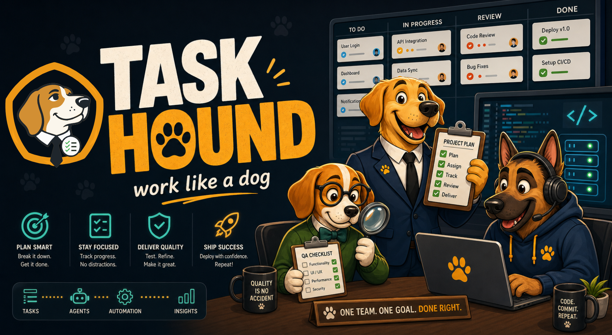

<p align="center">
  
</p>

<h1 align="center">Task Hounds - Work like a dog</h1>

<p align="center">
  <strong>A local multi-agent development workspace powered by OpenCode.</strong><br/>
  Give it a Human Directive. Watch Manager, Worker, Reviewer, and Chat agents move the project forward.
</p>

<p align="center">
  <a href="https://task-hounds.com">Website</a> ?
  <a href="https://github.com/catowabisabi/task-hounds">GitHub</a> ?
  <a href="https://www.youtube.com/watch?v=pu-Rt8Ye4EQ&t=174s">Demo Video</a>
</p>

<p align="center">
  <a href="LICENSE"></a>
  
  
  
  
  
</p>

<p align="center">
  
</p>

Task Hounds is built for people who want a visible, controllable agent loop instead of a black-box coding assistant. State is stored in SQLite, agent sessions are tracked per project, and the dashboard shows what the agents are doing in real time.

## Highlights

- Manager / Worker / Reviewer / Chat roles for autonomous development loops
- OpenCode-backed execution with reusable role sessions
- SQLite-backed project sessions, directives, todos, reports, and agent state
- React dashboard for live streams, settings, suggestions, todos, and chat
- Electron desktop build for Windows portable `.exe`
- Docker build for server-style deployment
- MIT licensed

## Task Hounds Workflow

Task Hounds is built around a dog-pack style workflow: the human gives the pack a durable mission, the Manager keeps direction, the Worker carries one task, and the Reviewer sniffs for bugs, UX issues, dead ends, and safety risks before the next step.

<section>
  <h3>Core roles</h3>
  <table>
    <thead>
      <tr>
        <th>Role</th>
        <th>Purpose</th>
        <th>Primary inputs</th>
        <th>Primary outputs</th>
      </tr>
    </thead>
    <tbody>
      <tr>
        <td><strong>Human</strong></td>
        <td>Set the project mission and drop ideas without needing to stay in the loop.</td>
        <td>Project intent, product direction, feature ideas, corrections, questions.</td>
        <td><code>HUMAN_DIRECTIVE</code>, human thoughts/suggestions, suggested new tasks/items.</td>
      </tr>
      <tr>
        <td><strong>Manager</strong></td>
        <td>Understand all inputs, decide the next step, maintain the plan, and assign exactly one executable task.</td>
        <td>Human directive, manager message history, todos, worker report, reviewer feedback, and handoff at loop start.</td>
        <td><code>MANAGER_MESSAGE</code>, <code>PLAN</code>, <code>TODO_LIST</code>, <code>TODO_UPDATE_JSON</code>, worker task, verification, handoff update.</td>
      </tr>
      <tr>
        <td><strong>Worker</strong></td>
        <td>Execute one concrete task and report what actually changed.</td>
        <td>Human directive, manager message, current todo list, and the manager's selected task context.</td>
        <td><code>WORKER_REPORT</code>, files changed, test result, known issues.</td>
      </tr>
      <tr>
        <td><strong>Reviewer</strong></td>
        <td>Review the worker's output for QA, bugs, UI/UX problems, edge cases, stuck states, messy input, and safety/security risk.</td>
        <td>Human directive, manager message, worker report, files changed, test result, known issues.</td>
        <td>Reviewer feedback and suggested follow-up actions for the Manager to digest.</td>
      </tr>
    </tbody>
  </table>
</section>

<section>
  <h3>Human input contract</h3>
  <table>
    <thead>
      <tr>
        <th>Input</th>
        <th>Meaning</th>
        <th>Lifecycle</th>
      </tr>
    </thead>
    <tbody>
      <tr>
        <td><code>HUMAN_DIRECTIVE</code></td>
        <td>The durable project/session mission: for example, "build a Chinese learning app for young people" or "automate weather report generation".</td>
        <td>Copied into each new session from the previous session in the same project. The workflow never edits or deletes it automatically. Only a human manual edit changes it.</td>
      </tr>
      <tr>
        <td><code>HUMAN_NEW_THOUGHT_AND_SUGGESTION</code></td>
        <td>Direction, questions, product taste, concerns, or ideas: for example, "is the direction wrong?", "do we need passwords?", "try more colors?".</td>
        <td>The Manager digests it, may turn part of it into todo items, then marks it processed while keeping history.</td>
      </tr>
      <tr>
        <td><code>HUMAN_SUGGESTED_NEW_TASK_OR_ITEM</code></td>
        <td>A more explicit feature or work item: for example, "add export to PDF" or "add the dog banner back".</td>
        <td>The Manager adds it to the plan/todo system when appropriate, then marks the suggestion processed while keeping history.</td>
      </tr>
    </tbody>
  </table>
</section>

<section>
  <h3>Loop diagram</h3>
  <pre><code>HUMAN_DIRECTIVE
 MANAGER_MESSAGE history
 HUMAN_NEW_THOUGHT_AND_SUGGESTION
 HUMAN_SUGGESTED_NEW_TASK_OR_ITEM
 WORKER_REPORT
 REVIEWER_FEEDBACK
 TODO state
 HANDOFF at manager loop start only
-------------------------------
Manager INPUT_DIGEST
Manager DECISION
Manager MESSAGE
PLAN
TODO_LIST
TODO_UPDATE_JSON
SUGGESTION_CONTENT
SUGGESTION_VERIFICATION
HANDOFF_UPDATE JSON
-------------------------------
Worker executes one task
Worker writes WORKER_REPORT
Worker records files changed, test result, known issues
-------------------------------
Reviewer checks QA, bugs, UI/UX, possible problems,
stuck states, messy user input, safety and security risk
-------------------------------
Reviewer feedback returns to Manager
Manager decides whether to fix, continue, stop, or create the next task</code></pre>
</section>

<section>
  <h3>Hard rules</h3>
  <ul>
    <li><code>HUMAN_DIRECTIVE</code> is stable project/session purpose. The agent loop does not rewrite or delete it.</li>
    <li><code>MANAGER_MESSAGE</code> is shared guidance. It is sent back into the Manager, and is also available to the Worker and Reviewer.</li>
    <li>The Worker does not need the handoff. The Worker should receive the directive, manager message, todo list, and current task context.</li>
    <li>The Reviewer does not assign work directly. Reviewer feedback returns to the Manager like a structured suggestion.</li>
    <li><code>SUGGESTION_CONTENT</code> and <code>SUGGESTION_VERIFICATION</code> are for Manager digestion and task tracking; the Worker should be guided by the Manager message and todo context.</li>
    <li><code>TODO_UPDATE_JSON</code> is the machine-readable todo source of truth. If it is missing or invalid, Task Hounds should repair it before releasing work.</li>
    <li>Handoff is Manager memory. It is read at the start of a Manager loop and updated as JSON, not treated as Worker context.</li>
  </ul>
</section>

## Demo

<p align="center">
  <a href="https://www.youtube.com/watch?v=pu-Rt8Ye4EQ&t=174s">
    
  </a>
  <br/>
  <em>Click to watch the demo on YouTube.</em>
</p>

## Dashboard

<p align="center">
  
</p>

## Quick Start

### 1. Install requirements

You need:

- Python 3.11 or 3.12
- Node.js 20+
- npm
- OpenCode CLI available on `PATH`

#### OpenCode configuration notes

Task Hounds depends on `opencode run --attach <server> --format json` emitting JSON stream events. Do not add the Playwright MCP server to `opencode.json` unless you have verified streaming locally; current OpenCode builds can stop emitting attach JSON events when the Playwright MCP entry is present, which breaks live `think`, `tool`, and `step_end` streams.

When adding extra models, define them in `opencode.json` using the Anthropic-style provider/model format that OpenCode expects. Models that are not declared there are not selectable or usable by Task Hounds, and OpenCode may return `409` or `500` errors when the dashboard tries to run them.

Install Python dependencies:

```powershell
pip install -r requirements.txt
pip install .
```

Install and build the web UI:

```powershell
cd ui/web
npm ci
npm run build
cd ../..
```

### 2. Configure environment

Copy the example file:

```powershell
Copy-Item .env.example .env
```

The environment variable prefix is still `POWER_TEAMS_` for compatibility. You do not need to rename existing local settings.

Useful settings:

```env
POWER_TEAMS_DB=core/db/power_teams.db
POWER_TEAMS_REUSE_OPENCODE_SESSIONS=true
POWER_TEAMS_SILENCE_TIMEOUT=480
POWER_TEAMS_HARD_TIMEOUT=1200
```

### 3. Run the server

```powershell
$env:PYTHONPATH = "core"
python core\api\server.py --port 8765
```

Open http://localhost:8765.

### 4. Start work

In the dashboard:

1. Pick or create a project workspace.
2. Write a Human Directive.
3. Press Start Loop or Run Once.

Task Hounds requires a pending Human Directive before it starts autonomous work. Suggestions and manager messages are context, not permission to run.

## Docker

Build the image:

```bash
docker build -t task-hounds .
```

Run it:

```bash
docker run --rm -p 8765:8765 -v "$(pwd)/data:/app/data" task-hounds
```

Then open http://localhost:8765.

The Docker image does not include local runtime data, SQLite databases, logs, OpenCode config, or desktop build artifacts.

## Windows EXE

The desktop app is built with Electron. The portable executable version is `1.0.0`.

Build it on Windows:

```powershell
.\build_exe.ps1
```

Output is written to:

```text
ui/desktop/dist/
```

The EXE package includes source resources needed by the app and the built web UI. It does not package local runtime folders, SQLite databases, logs, or personal OpenCode config.

## Architecture

Task Hounds uses SQLite as the runtime source of truth.

Important tables include:

- `project_sessions` for workspaces and per-role OpenCode session IDs
- `agent_registry` for agent state, model, role binding, and last errors
- `user_directives` for human-origin work directives
- `session_todos` for visible project work items
- `worker_reports` and `manager_messages` for agent reports and feedback
- `suggestion_queue` for manager-proposed next steps

Compatibility text files under `core/runtime` are treated as runtime mirrors and fallbacks. New control flow should prefer the DB.

See [ARCHITECTURE.md](ARCHITECTURE.md) for more detail.

## Project Structure

```text
task-hounds/
  core/
    api/                 # HTTP API and dashboard server
    db/                  # SQLite schema and migrations
    power_teams/          # Python package (legacy module name)
      agents/             # Manager, Worker, Reviewer, shared agent utilities
      mvp/                # Runner loop
      runtime/            # OpenCode lifecycle and backend adapters
      skills/             # DB skill helpers
  ui/
    web/                  # React + Vite dashboard
    desktop/              # Electron desktop wrapper
  docs/
    guides/               # User guides
    architecture/          # Design notes
    image/                # Public README and release images
  Dockerfile
  .env.example
```

## What Is Not Committed

These are intentionally excluded from the public repo:

- Runtime folders and logs
- SQLite database files
- OpenCode config/home folders
- Local `.env` files
- Electron and frontend build output
- Internal debug logs
- Local test-chat and OpenCode experiment folders
- `.hermes` workspace files

## Development Checks

Backend syntax check:

```powershell
python -m py_compile core/api/server.py core/power_teams/db.py core/power_teams/agents/base.py core/power_teams/agents/manager.py core/power_teams/agents/worker.py core/power_teams/agents/reviewer.py core/power_teams/mvp/runner.py
```

Frontend build:

```powershell
cd ui/web
npm run build
```

## Contributing

Issues and pull requests are welcome at https://github.com/catowabisabi/task-hounds.

Please keep runtime artifacts, database files, local OpenCode config, logs, and secrets out of commits.

## License

MIT. See [LICENSE](LICENSE).
