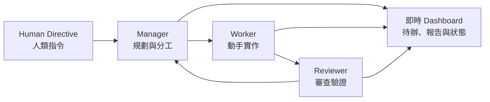

<p align="center">
  <a href="README.md">English</a>
  &nbsp;·&nbsp;
  <a href="README.zh-TW.md"><strong>繁體中文</strong></a>
</p>

<p align="center">
  
</p>

<h1 align="center">Task Hounds</h1>

<p align="center">
  <strong>Work like a dog. Ship like a pack.</strong><br>
  由 OpenCode 驅動、本機優先且過程透明的多代理開發工作空間。
</p>

<p align="center">
  <a href="https://task-hounds.com">官方網站</a>
  · <a href="https://github.com/catowabisabi/task-hounds">GitHub</a>
  · <a href="https://www.youtube.com/watch?v=pu-Rt8Ye4EQ&t=174s">示範影片</a>
  · <a href="https://github.com/catowabisabi/task-hounds/issues">問題回報</a>
</p>

<p align="center">
  <a href="https://github.com/catowabisabi/task-hounds/actions/workflows/ci.yml"></a>
  <a href="LICENSE"></a>
  
  
  
  
</p>

<p align="center">
  
</p>

## Task Hounds 是什麼？

Task Hounds 把你的一個目標，轉化為清楚可見的軟體開發循環。你只需要給團隊一個 **Human Directive（人類指令）**：Manager 負責規劃、Worker 動手實作、Reviewer 檢查成果，再開始下一項工作。

它不是一個看不見內部狀態的黑盒助理。指令、計畫、待辦事項、工作報告、代理狀態與可重用的 OpenCode 對話都會儲存在本機；Dashboard 則會即時呈現每個代理正在做什麼。

它適合想要運用代理自主開發，同時仍然掌握方向、脈絡與品質的開發者。

## 認識你的狗狗團隊

| 角色 | 職責 |
| --- | --- |
| **你（Human）** | 設定長期專案目標，隨時加入想法或調整方向。 |
| **Manager** | 理解完整脈絡、維護計畫，每次指派一項明確工作。 |
| **Worker** | 實作指定工作，回報修改檔案、測試結果與已知問題。 |
| **Reviewer** | 檢查錯誤、使用體驗、邊界情況與安全風險。 |
| **Chat** | 讓你直接討論專案並與整個系統互動。 |



## 完整工作流程

### 人類輸入規則

| 輸入 | 意義 | 生命週期 |
| --- | --- | --- |
| `HUMAN_DIRECTIVE` | 專案或對話長期不變的核心任務。 | 同一專案建立新對話時會自動沿用。代理流程不會自行修改或刪除，只有人類可以變更。 |
| `HUMAN_NEW_THOUGHT_AND_SUGGESTION` | 方向、問題、產品品味、疑慮或想法。 | Manager 消化內容，視需要轉為待辦事項，再標記為已處理並保留歷史。 |
| `HUMAN_SUGGESTED_NEW_TASK_OR_ITEM` | 明確的功能或工作項目。 | Manager 在適當時加入計畫與待辦系統，再標記為已處理並保留歷史。 |

整個循環建立在明確的訊息契約上：Manager 消化輸入、做決策、維護計畫，每輪只釋出一個任務；Worker 實作並提交結構化報告；Reviewer 驗證後把回饋送回 Manager。機器可讀的待辦 JSON 會先驗證（無效則修復）才釋出工作。

**完整規格——完整循環、角色與資料流圖、時序圖與不可破壞的規則：[docs/architecture/agent-loop-contract.md](docs/architecture/agent-loop-contract.md)**

## 為什麼選擇 Task Hounds？

- **本機優先**：工作空間、資料庫、執行狀態與紀錄都保留在你的電腦。
- **過程透明**：即時查看思考過程、工具活動、待辦、報告與審查意見。
- **脈絡可延續**：以 SQLite 保存專案狀態，並重用各角色的 OpenCode 對話。
- **角色分工清楚**：規劃、實作與審查交給不同代理，減少自說自話。
- **人類隨時掌舵**：透過長期指令、新想法與建議任務調整方向。
- **多種執行方式**：支援網頁 Dashboard、Windows 桌面程式、Docker 與實驗性 Android 用戶端。
- **自由開源**：採用 MIT License，可自由修改與延伸。

## 實際畫面

<p align="center">
  <a href="https://www.youtube.com/watch?v=pu-Rt8Ye4EQ&t=174s">
    
  </a>
</p>

<p align="center">
  
</p>

## 快速開始

### 最快方式：Docker Compose（任何平台）

```bash
git clone https://github.com/catowabisabi/task-hounds.git
cd task-hounds
docker compose up
```

然後開啟 [http://localhost:8765](http://localhost:8765)。映像會自動建置 Dashboard，不需要另外安裝 Python 或 Node。專案資料會保存在 `./data`。

### 從原始碼安裝（Windows，最適合受管理的執行環境）

#### 系統需求

- Windows（最適合使用受管理的執行環境與桌面版）
- Python 3.11+
- Node.js 20+
- npm

### 1. 下載並安裝

```powershell
git clone https://github.com/catowabisabi/task-hounds.git
cd task-hounds

.\installation.cmd
pip install -r requirements.txt
pip install .
```

`installation.cmd` 會安裝 Task Hounds 指定版本、由專案管理的 OpenCode 執行環境。

### 2. 建置 Dashboard

```powershell
cd ui/web
npm ci
npm run build
cd ../..
```

### 3. 設定環境

```powershell
Copy-Item .env.example .env
```

為了向下相容，環境變數仍使用 `POWER_TEAMS_` 前綴。加入模型供應商金鑰或將 API 開放至 localhost 以外的位置前，請先閱讀 `.env.example`。

### 4. 啟動

```powershell
task-hounds-serve --port 8765
```

（等效指令：`python -m task_hounds_api --port 8765`。）

開啟 [http://localhost:8765](http://localhost:8765)，建立或選擇工作空間、輸入 Human Directive，然後按下 **Start Loop** 或 **Run Once**。

> 沒有待處理的 Human Directive 時，Task Hounds 不會自行啟動代理開發循環。

專案預設建立在 `~/task-hounds-projects`，可用環境變數 `TASK_HOUNDS_PROJECTS_DIR` 覆寫。已在使用 `C:\task-hounds-projects` 的既有安裝不受影響，會繼續沿用原路徑。

完整說明請參考[快速入門指南](docs/guides/getting-started.md)。

## 模型供應商

Task Hounds 透過 OpenCode 的 Anthropic 相容供應商呼叫模型，內建三家——備妥任一組金鑰即可運作：

| 供應商 | 模型 | 環境變數 |
| --- | --- | --- |
| MiniMax（預設） | `MiniMax-M2.7` | `OPENCODE_API_KEY_MINIMAX` |
| Moonshot Kimi | `kimi-k3`（1M context）、`kimi-k2.7-code`、`kimi-k2.7-code-highspeed` | `OPENCODE_API_KEY_KIMI` |
| 阿里雲百鍊 | Qwen3.x、GLM、Kimi K2.5 | `OPENCODE_API_KEY_BAILIAN` |

所有角色的預設模型為 `minimax-coding-plan/MiniMax-M2.7`。

### 整個團隊切換到 Kimi K3

Kimi K3 具備 1M token context、預設開啟 thinking，非常適合長時間的代理循環。到 [Kimi 開放平台](https://platform.kimi.ai/console/api-keys)取得金鑰後，在 `.env` 加入：

```dotenv
OPENCODE_API_KEY_KIMI=your_kimi_api_key
TASK_HOUNDS_OPENCODE_MODEL=kimi-coding-plan/kimi-k3
```

重新啟動後，Manager、Worker、Reviewer 全部改跑 Kimi K3。也可以直接在 Dashboard 的 Runtime 面板貼上金鑰，或在 binding 編輯器為每個角色個別選擇模型。

### 各角色混用模型

每個角色獨立解析模型，可以把最強的推理模型放在最需要的位置：

```dotenv
TASK_HOUNDS_MANAGER_OPENCODE_MODEL=kimi-coding-plan/kimi-k3
TASK_HOUNDS_REVIEWER_OPENCODE_MODEL=kimi-coding-plan/kimi-k3
# Worker 維持預設的 MiniMax-M2.7
```

在 Dashboard 設定的角色 binding（存於 DB）優先於這些環境變數。

## 其他執行方式

### Docker

```bash
docker build -t task-hounds .
docker run --rm -p 8765:8765 -v "$(pwd)/data:/app/data" task-hounds
```

### 以 pip 從 Git 安裝

```bash
pip install git+https://github.com/catowabisabi/task-hounds.git
task-hounds --port 8765
```

這會安裝後端伺服器與 CLI。Web Dashboard 需在 repo 目錄或 Docker 環境下提供；純 pip 安裝只提供 HTTP API。

### Windows 桌面版

```powershell
.\build_exe.ps1
```

Electron 可攜版程式會輸出至 `ui/desktop/dist/`。

### Android 用戶端

實驗性的 React + Capacitor 用戶端位於 `ui/mobile/`。它會連接相同的後端，共用專案、對話、待辦、Chat 與代理狀態。建議透過 [Tailscale Serve](https://tailscale.com/docs/features/tailscale-serve) 私密連線，請勿將 Task Hounds 後端直接暴露在公開網路。

設定方式請參考 [ui/mobile/README.md](ui/mobile/README.md)。

## 系統架構

SQLite 是執行階段的資料來源，保存專案對話、指令、待辦、報告、建議與代理狀態。`core/runtime/` 內的相容性檔案只作為本機執行映像與備援。

```text
task-hounds/
├── core/
│   ├── db/                  # SQLite schema、migrations 與備份
│   ├── runtime/             # 本機執行狀態與紀錄（不提交）
│   └── task_hounds_api/     # 後端：FastAPI 伺服器、代理工作流、OpenCode 執行環境
│       ├── api/             # HTTP API 與 Dashboard 伺服器
│       ├── db/              # 資料庫存取層
│       ├── opencode/        # 受管理的 OpenCode 執行環境與 client
│       └── workflow/        # Manager/Worker/Reviewer 循環、契約與修復
├── ui/
│   ├── web/                 # React + Vite Dashboard
│   ├── desktop/             # Electron 桌面程式
│   └── mobile/              # React + Capacitor Android 用戶端
├── docs/                    # 指南、架構、測試與圖片
├── docker-compose.yml
├── Dockerfile
└── .env.example
```

執行資料、SQLite 資料庫、紀錄、本機 `.env`、個人 OpenCode 設定與建置產物都不會提交至公開 repository。

## 參與開發

後端測試：

```powershell
pytest
```

Web Dashboard：

```powershell
cd ui/web
npm run build
```

歡迎提交功能想法、錯誤回報與 Pull Request。開始前請閱讀 [CONTRIBUTING.md](CONTRIBUTING.md)；若要回報安全問題，請參考 [SECURITY.md](SECURITY.md)。

## 支持這個專案

如果 Task Hounds 幫你節省了時間，或你也喜歡「一小群 AI 狗狗一起寫軟體」這個主意，歡迎請我喝杯咖啡。你的支持會用於持續開發、測試，以及餵飽虛擬狗狗背後那位需要真咖啡的人。

<p align="center">
  <a href="https://buymeacoffee.com/catowabisabi?new=1">
    
  </a>
</p>

## 授權

Task Hounds 採用 [MIT License](LICENSE) 發布。
