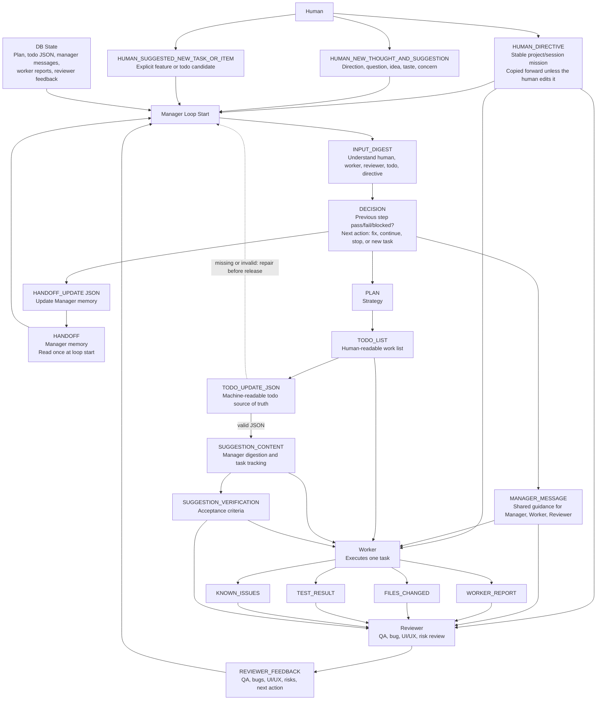
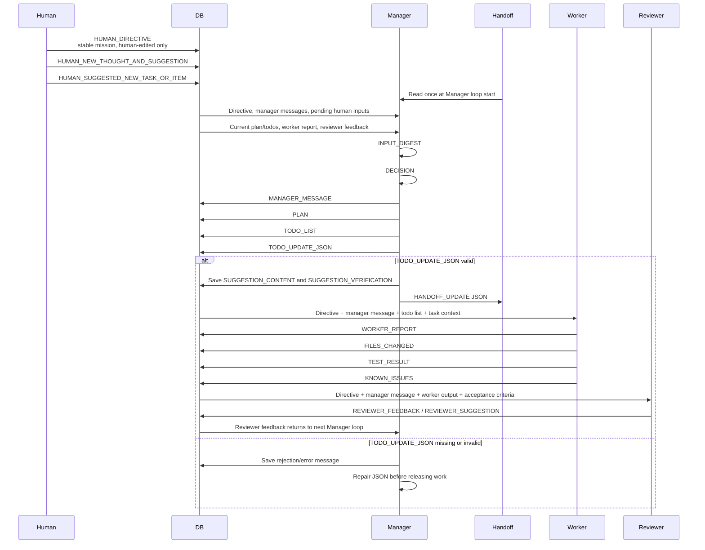

# Agent Loop Contract

This document is the full specification of the Task Hounds agent loop: the exact
message contract, data flow, and sequencing between the Human, Manager, Worker,
and Reviewer. For a high-level overview, see the [README](../../README.md).

## Human input contract

| Input | Meaning | Lifecycle |
| --- | --- | --- |
| `HUMAN_DIRECTIVE` | The durable project or session mission. | Copied into each new session in the same project. The agent loop never edits or deletes it; only a human can change it. |
| `HUMAN_NEW_THOUGHT_AND_SUGGESTION` | Direction, questions, product taste, concerns, or ideas. | The Manager digests it, may turn it into todo items, then marks it processed while preserving its history. |
| `HUMAN_SUGGESTED_NEW_TASK_OR_ITEM` | An explicit feature or work item. | The Manager adds it to the plan and todo system when appropriate, then marks it processed while preserving its history. |

## Complete loop

```text
HUMAN_DIRECTIVE
MANAGER_MESSAGE history
HUMAN_NEW_THOUGHT_AND_SUGGESTION
HUMAN_SUGGESTED_NEW_TASK_OR_ITEM
WORKER_REPORT
REVIEWER_FEEDBACK
TODO state
HANDOFF at Manager loop start only
─────────────────────────────────
Manager INPUT_DIGEST
Manager DECISION
Manager MESSAGE
PLAN
TODO_LIST
TODO_UPDATE_JSON
SUGGESTION_CONTENT
SUGGESTION_VERIFICATION
HANDOFF_UPDATE JSON
─────────────────────────────────
Worker executes one task
Worker writes WORKER_REPORT
Worker records files changed, test result, and known issues
─────────────────────────────────
Reviewer checks QA, bugs, UI/UX, possible problems,
stuck states, messy user input, and safety/security risks
─────────────────────────────────
Reviewer feedback returns to Manager
Manager decides whether to fix, continue, stop, or create the next task
```

## Role and data flow



## Time sequence



## Hard rules

- `HUMAN_DIRECTIVE` is the stable project or session purpose. The agent loop does not rewrite or delete it.
- `MANAGER_MESSAGE` is shared guidance for the Manager, Worker, and Reviewer.
- The Worker receives the directive, Manager message, todo list, and current task context—not the handoff.
- The Reviewer does not assign work directly. Its structured feedback returns to the Manager.
- `SUGGESTION_CONTENT` and `SUGGESTION_VERIFICATION` support Manager digestion and task tracking.
- `TODO_UPDATE_JSON` is the machine-readable todo source of truth. Missing or invalid JSON must be repaired before work is released.
- Handoff is Manager memory: read at the start of a Manager loop and updated as JSON.

